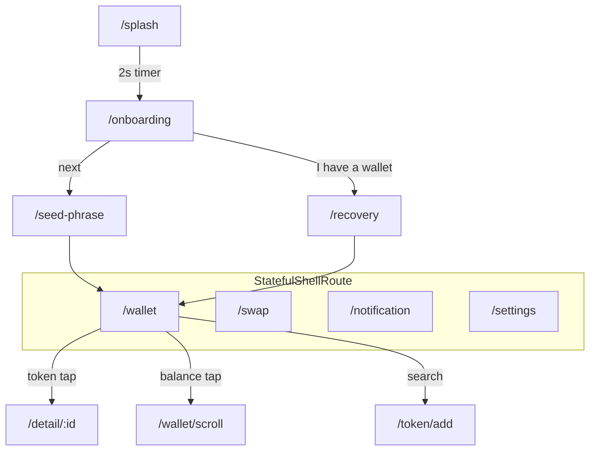

# Architecture — figma_009

## Overview

Feature-based MVVM Flutter app mapped from the **Wallet** Figma file (375×812). Presentation-heavy: mock data in `features/*/data/`, no domain services yet.

```
lib/
├── main.dart                 # Web: enable GoogleFonts runtime fetch
├── app.dart                  # MaterialApp.router + AppTheme.dark()
├── core/
│   ├── constants/
│   │   ├── design_constants.dart   # spacing, radii, bar heights
│   │   └── wallet_assets.dart      # all asset/icon paths + coinForId()
│   ├── router/
│   │   ├── app_routes.dart         # path constants
│   │   └── app_router.dart         # GoRouter + StatefulShellRoute
│   └── theme/
│       ├── app_colors.dart
│       ├── app_typography.dart
│       ├── app_theme.dart
│       └── wallet_theme_extension.dart
├── shared/
│   ├── layouts/main_shell.dart     # 4-tab shell
│   └── widgets/
│       ├── bars/                   # WalletNavigationBar, WalletBottomTabBar
│       ├── buttons/                # Primary, Circle, SlideConfirm, …
│       ├── cells/                  # Token, Notification, Menu, AddToken
│       └── other/                  # WalletAssetIcon, WalletCoinIcon, titles
└── features/
    ├── onboarding/    # splash, onboarding, seed phrase, recovery
    ├── wallet/        # wallet tab, detail, scroll, scan
    ├── transaction/   # send, buy, receive, swap
    ├── token/         # add, search, custom
    ├── notification/
    └── settings/      # security, passcode, autolock, …
```

## Navigation

### Flow diagram



### Route table

| Path | Screen | Figma frame (node) |
|------|--------|-------------------|
| `/splash` | SplashScreen | Splash screen `0:68` |
| `/onboarding` | OnboardingScreen | Onboarding `0:57` |
| `/seed-phrase` | SeedPhraseScreen | Seed Phrase `0:25` |
| `/recovery` | RecoveryScreen | Recovery `0:45` |
| `/wallet` | WalletScreen | Wallet `0:2` |
| `/wallet/scroll` | WalletScrollScreen | Wallet - Scroll `0:119` |
| `/swap` | SwapScreen | Swap `0:445` |
| `/notification` | NotificationScreen | Notification `0:453` |
| `/settings` | SettingsScreen | Settings `0:472` |
| `/settings/security` | SettingsSecurityScreen | Settings - Security `0:517` |
| `/settings/security/passcode` | SettingsPasscodeScreen | — |
| `/settings/security/autolock` | SettingsAutoLockScreen | — |
| `/settings/security/method` | SettingsMethodScreen | — |
| `/settings/input` | SettingsInputScreen | Settings - Input `0:416` |
| `/settings/slide` | SettingsSlideScreen | — |
| `/settings/wallet` | SettingsWalletScreen | — |
| `/settings/price-alerts` | SettingsPriceAlertsScreen | — |
| `/detail/:id` | DetailScreen | Detail `0:135` |
| `/scan` | ScanScreen | Scan `0:328` |
| `/token/add` | AddTokenScreen | Add Token `0:157` |
| `/token/add/search` | AddTokenSearchScreen | Add Token - Search `0:178` |
| `/token/custom` | CustomTokenScreen | Custom Token `0:185` |
| `/send` | SendScreen | Send `0:206` |
| `/send/detail` | SendDetailScreen | Send - Detail `0:363` |
| `/buy` | BuyScreen | Buy `0:196` |
| `/buy/detail` | BuyDetailScreen | — |
| `/receive` | ReceiveScreen | Receive `0:215` |
| `/receive/detail` | ReceiveDetailScreen | — |

Paths are defined in `lib/core/router/app_routes.dart`; wiring in `app_router.dart`.

### Shell tabs

`MainShell` uses `StatefulShellRoute.indexedStack` with four branches aligned to `WalletBottomTabBar` indices:

0. Wallet → `/wallet`
1. Swap → `/swap`
2. Notification → `/notification`
3. Settings → `/settings`

Tab icons: Figma Symbols via `WalletAssets.tab*`.

## State & data

- UI state: `StatefulWidget` / local fields; no global store.
- Lists: `ListView.builder` with mock lists (`MockWalletTokens`, `MockMarketTokens`, etc.).
- Navigation: `context.go` / `context.push` / `context.pop` (`go_router`).
- Planned pattern: `ValueNotifier` + `ListenableBuilder` when live data arrives.

## Assets

| Category | Location | Widget |
|----------|----------|--------|
| Tab icons (32px) | `assets/icons/tab_*.png` | `WalletBottomTabBar` |
| Nav / action (32px) | `assets/icons/icon_*.png` | `WalletAssetIcon` |
| Settings (56px) | `assets/icons/set_*.png` | `WalletListMenuCell` |
| Coins (56px) | `assets/icons/coin_*.png` | `WalletCoinIcon` |
| Trend arrow | `icon_arrow.png` + rotate | `WalletTrendIcon` |

All paths centralized in `WalletAssets`. Export new icons with Figma MCP `save_screenshots` (PNG, scale 2).

## Shared components (Figma mapping)

| Figma prefix | Dart location | Key widgets |
|--------------|---------------|-------------|
| `Bar / Navigation` | `shared/widgets/bars/` | `WalletNavigationBar` |
| `Bar / Bottom / Tab Bar` | `shared/widgets/bars/` | `WalletBottomTabBar` |
| `Button /` | `shared/widgets/buttons/` | `WalletPrimaryButton`, `WalletSlideConfirm` |
| `Cell /` | `shared/widgets/cells/` | `WalletTokenCell`, `WalletListMenuCell` |
| `Icon /` | `assets/icons/` + `other/wallet_*_icon.dart` | `WalletAssetIcon`, `WalletCoinIcon` |
| `Other /` | `shared/widgets/other/` | `WalletSectionTitle`, `GradientTitleText` |

## Theme

- **Colors:** `AppColors` — Figma paint styles (gradients as `LinearGradient` / `RadialGradient`).
- **Typography:** Clash Display (titles) → **Space Grotesk** fallback via Google Fonts; Poppins (body) via `google_fonts`.
- **Spacing:** `DesignConstants` — 4/8/16/20/24/32, tab bar 96px, nav bar 56px.
- **Extension:** `WalletThemeExtension` for wallet-specific tokens.

## Figma MCP workflow

1. `get_metadata` — file name, current page
2. `get_design_context(depth=2, detail="compact")` — screen tree
3. `get_node` / `scan_text_nodes` — drill into sections
4. `save_screenshots` — export Symbols to `assets/icons/`
5. Register path in `WalletAssets`, wire widget, add widget test

Node IDs use **colon** format (`0:68`), not hyphen.

## Testing strategy

- Widget tests per screen / shared component (see [TESTING.md](TESTING.md)).
- Shell navigation: `createAppRouter()` + `router.go` + tab `ValueKey`s.
- Google Fonts network disabled in tests.